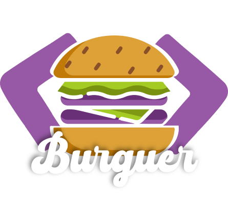
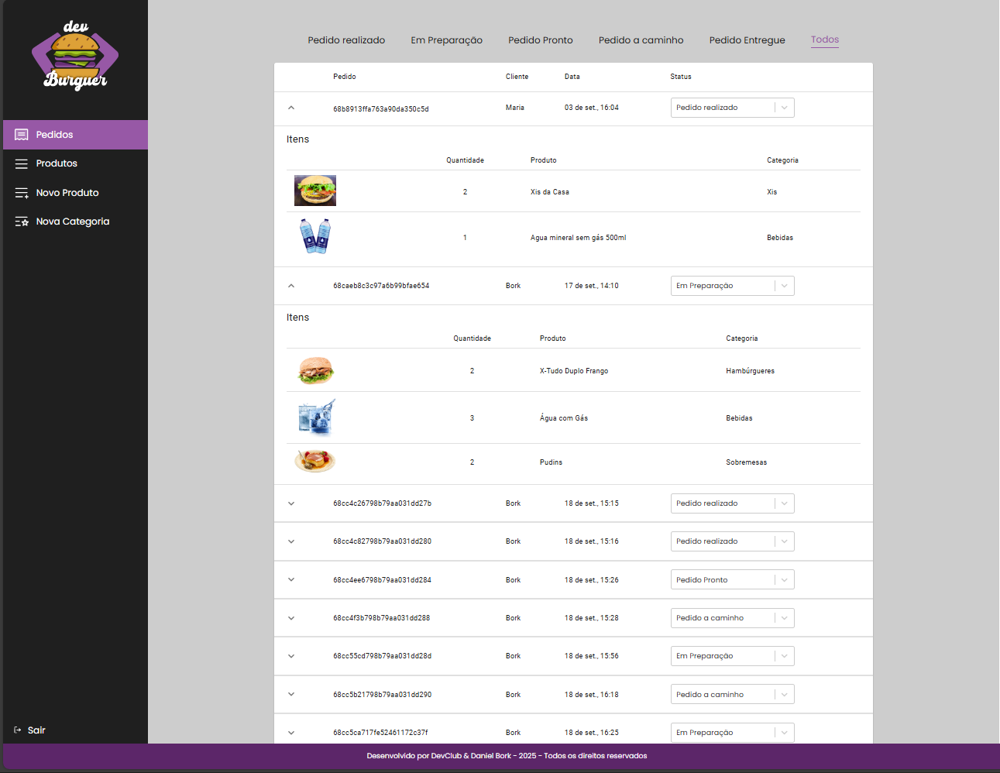
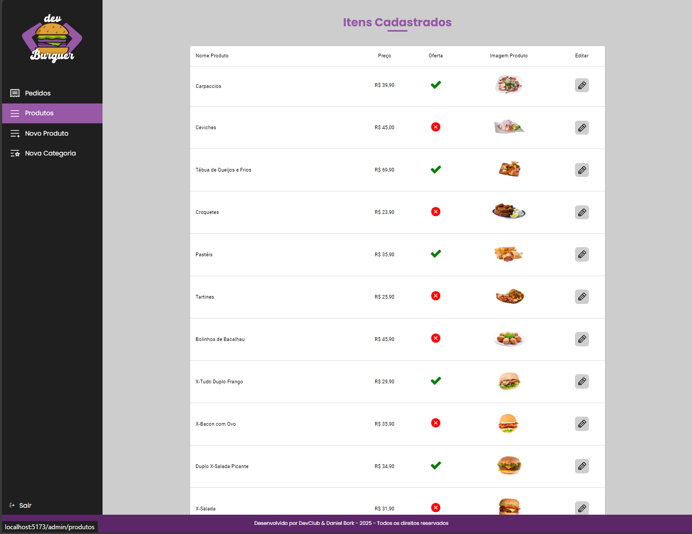
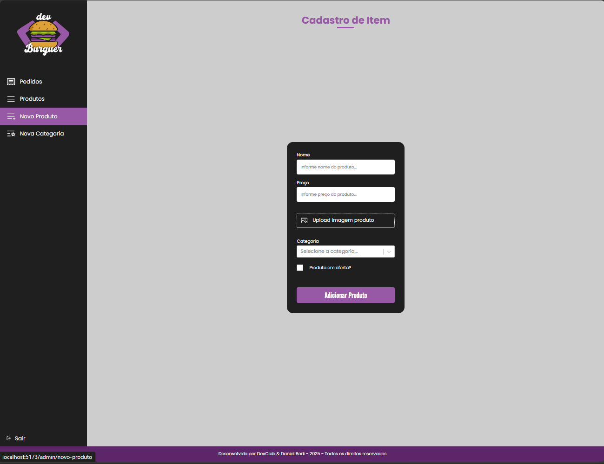

<h1>DevBurger</h1>

## 📝 Sobre

O projeto <b>DevBurger</b> apresenta uma hamburgueria fictícia com funcionalidades gerais como: login e criação de usuários, Home com carrossel de categorias e ofertas, exibição e filtragem do cardápio, etc e administrativas como: a adição e edição dos produtos e categorias, tela de pedidos que realiza a soma do total e possui interface de pagamentos funcional. 

## ⚙ Funcionalidades

Para exibir a grade de produtos, clique no botão <i>Cardápio</i> na parte superior para acessar a página. 
 
No <i>Cardápio</i>, também é possível filtrar os produtos por categoria e exibi-los na tela. O botão <i>Home</i> retorna a tela inicial.  
Para acessar seus pedidos, clique em <i>Carrinho</i> e verifique sua compra com os valores de cada item e o total, finalizando com a tela de pagamentos. 
 
Já na parte administrativa, acessiveis via menu lateral, temos a tela de <i>Pedidos<i> onde podem ser gerenciados os pedidos realizados bem como seu status 
Tela de <i>Produtos</i> onde são exibidos os produtos cadastrados na loja e permite alterá-los conforme a necessidade.  
  
  
E por fim, a tela de <i>Novos Produtos/Novas categorias</i> onde são adicionados novos produtos e categorias.  
  

## 🤝🏻 Agradecimentos

Agradeço ao <a href="https://www.github.com/rodolfomori">Rodolfo Mori</a>, mentor do DevClub, pelos conhecimentos que obtive para codificação e inovação do projeto. 

## 🖥 Tecnologias

Este projeto foi desenvolvido com HTML, CSS e JavaScript com React. E interage com o Back-end (<a href="https://github.com/bork85/DevBurger---Backend">Devburger-Backend</a>) que utiliza Javascript com Node.  

          

         

## 💡 Proximos Passos

Acrescentar outros metodos de pagamento como Pix, debito  
Criar novas funcionalidades como Adicionar categorias, editar categorias  
Acrescentar detalhes de cada produto  
Funcionalidade para acrescentar detalhes nos pedidos  

Enfim, este projeto está apenas começando...
