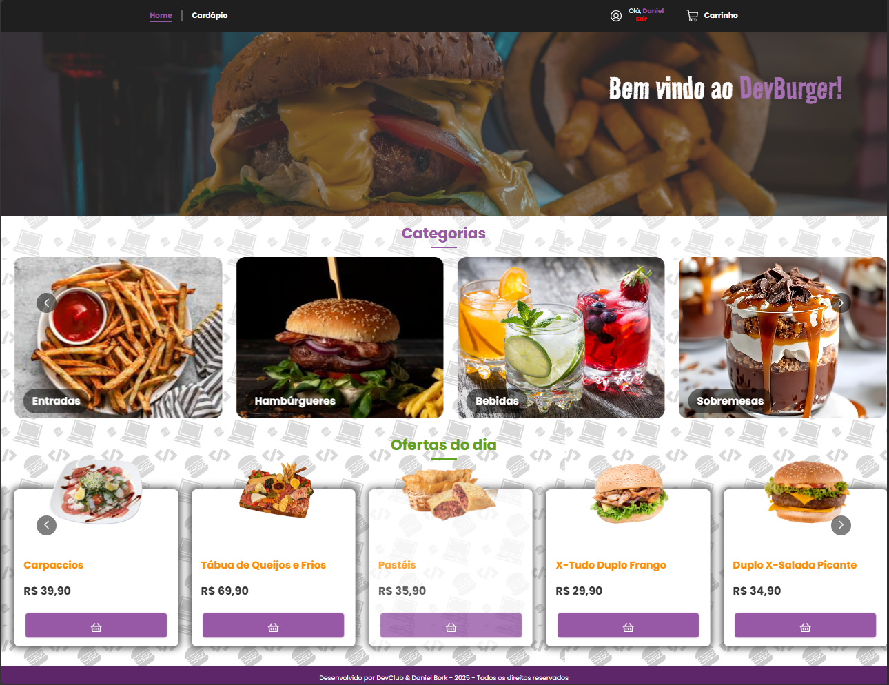
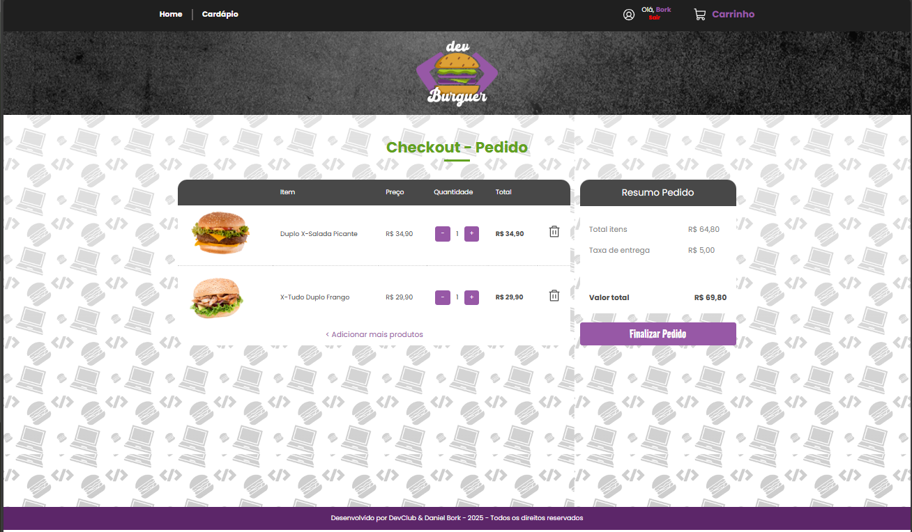
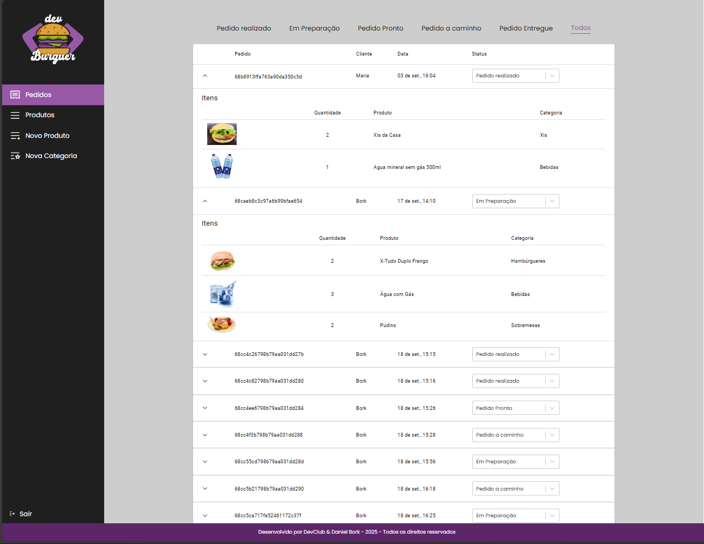
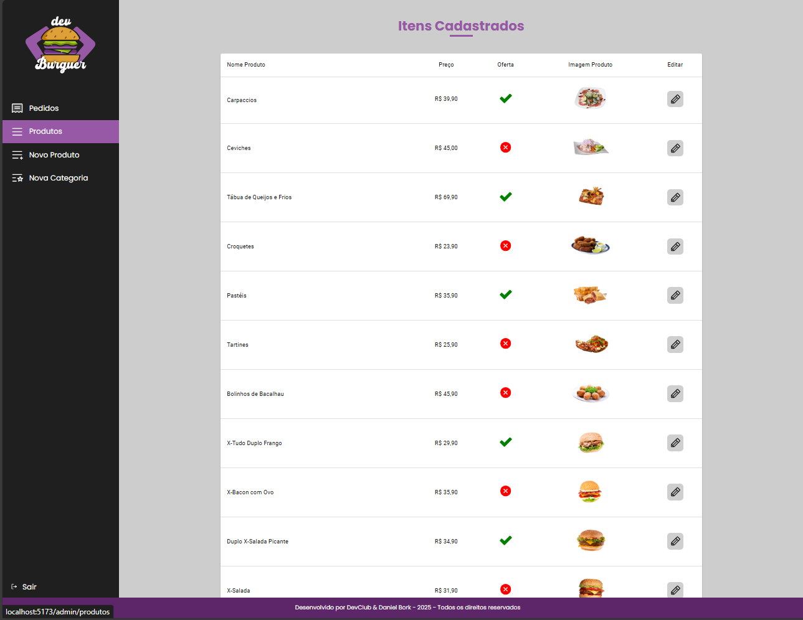
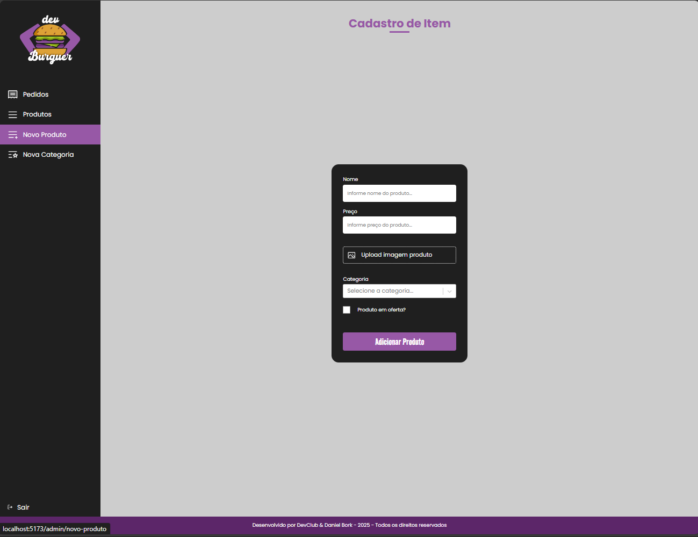

# 🍔 DevBurger - Interface

<p align="center">

</p>

Uma aplicação web completa de hamburgueria desenvolvida com React, oferecendo experiência moderna tanto para clientes quanto para administradores.

## 📝 Sobre

O projeto **DevBurger** apresenta uma hamburgueria fictícia com funcionalidades gerais como: login e criação de usuários, Home com carrossel de categorias e ofertas, exibição e filtragem do cardápio, etc e administrativas como: a adição e edição dos produtos e categorias, tela de pedidos que realiza a soma do total e possui interface de pagamentos funcional.

## ✨ Características

🛒 **Carrinho de Compras**: Sistema completo de gerenciamento de pedidos

🎨 **Interface Moderna**: Design responsivo e intuitivo

🔐 **Autenticação**: Sistema de login e cadastro de usuários

📱 **Responsivo**: Layout adaptativo para todos os dispositivos

🎯 **Categorias**: Filtragem dinâmica de produtos por categoria

💳 **Pagamentos**: Interface funcional de processamento de pagamentos

👨‍💼 **Painel Admin**: Gerenciamento completo de produtos, categorias e pedidos

🎠 **Carrossel**: Exibição de ofertas e categorias em destaque

## ⚙ Funcionalidades

Para exibir a grade de produtos, clique no botão <i>Cardápio</i> na parte superior para acessar a página.<br>
<br>
No <i>Cardápio</i>, também é possível filtrar os produtos por categoria e exibi-los na tela. O botão <i>Home</i> retorna a tela inicial. <br>
Para acessar seus pedidos, clique em <i>Carrinho</i> e verifique sua compra com os valores de cada item e o total, finalizando com a tela de pagamentos.<br>
<br>
Já na parte administrativa, acessíveis via menu lateral, temos a tela de <i>Pedidos</i> onde podem ser gerenciados os pedidos realizados bem como seu status. 
Tela de <i>Produtos</i> onde são exibidos os produtos cadastrados na loja e permite alterá-los conforme a necessidade. <br>
 <br>
 <br>
E por fim, a tela de <i>Novos Produtos/Novas Categorias</i> onde são adicionados novos produtos e categorias. <br>
 <br>

## 📁 Estrutura do Projeto

```bash
devburger-interface/
├── src/
│   ├── assets/          # Imagens e recursos estáticos
│   ├── components/      # Componentes React reutilizáveis
│   ├── containers/      # Páginas e containers principais
│   ├── hooks/           # Custom hooks
│   ├── routes/          # Configuração de rotas
│   ├── services/        # Integração com API
│   └── styles/          # Estilos globais
├── public/              # Arquivos públicos
└── package.json         # Dependências do projeto
```

## 🛠️ Tecnologias Utilizadas

**Frontend:**

- HTML5: Estrutura semântica
- CSS3: Estilos modernos e responsivos
- JavaScript (ES6+): Lógica da aplicação
- React: Biblioteca para construção de interfaces
- React Router: Navegação entre páginas
- React Hook Form: Gerenciamento de formulários
- Styled Components: Estilização de componentes

**Backend Integration:**

- Node.js: Ambiente de execução
- API RESTful: Comunicação com backend

<p>


</p>

## 🚀 Como Usar

**1. Clone o repositório**

```bash
git clone https://github.com/bork85/devburger-interface.git
cd devburger-interface
```

**2. Instale as dependências**

```bash
npm install
```

**3. Configure as variáveis de ambiente**

Crie um arquivo `.env` na raiz do projeto com as configurações necessárias para conexão com o backend.

**4. Inicie o servidor de desenvolvimento**

```bash
npm start
```

**5. Acesse no navegador**

```
http://localhost:3000
```

## 🔗 Backend

Este projeto interage com o backend DevBurger desenvolvido em Node.js:

👉 [DevBurger - Backend](https://github.com/bork85/DevBurger---Backend)

## 💡 Próximos Passos

- [ ] Acrescentar outros métodos de pagamento como Pix, débito
- [x] Criar novas funcionalidades como Adicionar categorias, editar categorias
- [ ] Acrescentar detalhes de cada produto
- [ ] Funcionalidade para acrescentar detalhes nos pedidos
- [ ] Implementar sistema de avaliações
- [ ] Adicionar histórico de pedidos do usuário

Enfim, este projeto está apenas começando...

## 🤝🏻 Agradecimentos

Agradeço ao [Rodolfo Mori](https://www.github.com/rodolfomori), mentor do DevClub, pelos conhecimentos que obtive para codificação e inovação do projeto.

## 📄 Licença e Copyright

© 2025 - DevBurger - Todos os direitos reservados

Feito com ❤️ por [bork85](https://github.com/bork85)

## ✉️ Contato

**E-mail:** daniel.bork@yahoo.com.br

---

**Versão:** 1.0  
**Idioma:** Português (Brasil)  
**Última Atualização:** 2025
